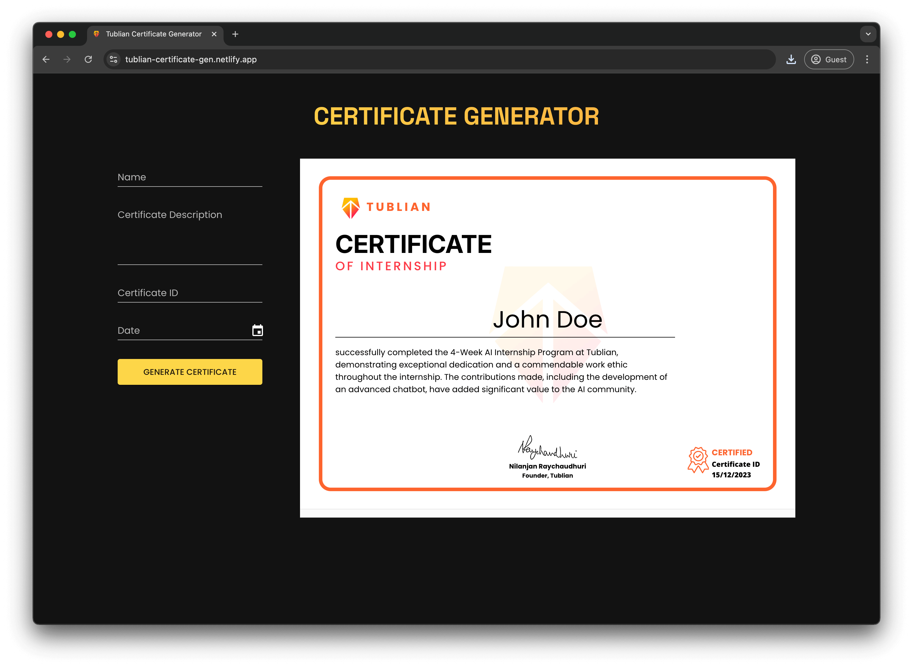

# Tublian Certificate Generator

This is a website that allows Tublian to automate their certificate generation process

## Table of Contents

- [Screenshot](#screenshot)
- [Getting Started](#getting-started)
  - [Tech Stack](#tech-stack)
  - [Prerequisites](#prerequisites)
  - [Installation](#installation)
- [Running the Application](#running-the-application)

## Screenshot



## Getting Started

### Tech Stack

- **Frontend:** React.js, KendoReact PDF
- **Styling:** CSS & Material UI
- **Build Tool:** Vite
- **Deployment:** Netlify
- **Version Control:** Git, Github

### Prerequisites

List any prerequisites or dependencies that need to be installed before running the application. For example:

- [Node.js](https://nodejs.org/) (v18.10.0 or higher)
- [yarn](https://yarnpkg.com/) (v1.22.22 or higher)

> Please use only `yarn` for this project.

### Installation

1. Clone the repository:

   ```bash
   git clone https://github.com/IEdiong/certificate-generator.git
   ```

2. Navigate to the project directory:

   ```bash
   cd certificate-generator
   ```

3. Install project dependencies:

   ```bash
   yarn install
   ```

## Running the Application

After completing the installation steps, you can run the application using the following command:

```bash
yarn dev
```

The development server will start, and the application will be accessible at [http://localhost:5173](http://localhost:5173)
